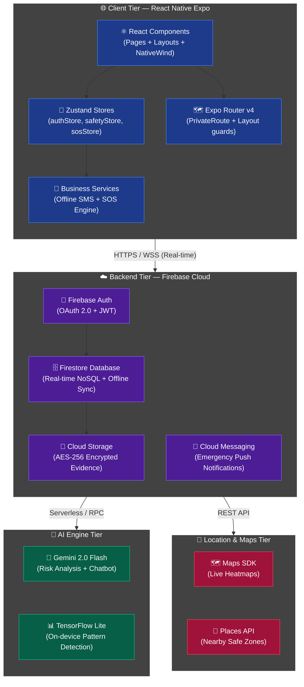
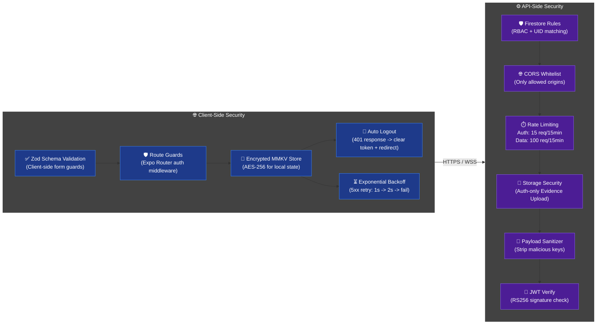
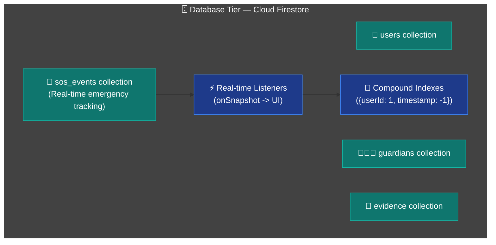

<p align="center">
  
</p>

<h1 align="center">SafeSphere AI</h1>
<h3 align="center"><code>Predict. Protect. Prevent.</code></h3>

<p align="center">
  <b>A Zero-Trust, Predictive Safety Ecosystem</b><br/>
  <sub>Next-generation intelligent safety platform leveraging Edge AI and zero-touch triggers.</sub>
</p>

<br/>

<p align="center">
  
  
  
  
</p>

---

## 🎯 The Problem & Our Approach

Traditional safety applications are purely **reactive**—they require a victim in distress to manually unlock their phone, navigate to an app, and press an SOS button. In high-stress or physical attack scenarios, this interaction is near impossible.

**SafeSphere AI** fundamentally shifts the paradigm from reactive monitoring to **predictive analytics and autonomous response**. By analyzing real-time environmental factors on-device and utilizing zero-touch triggers, the platform acts before a situation escalates.

---

## 🏗️ System Architecture

The platform operates on a **4-tier architecture** spanning the mobile client, Firebase serverless backend, AI processing layer, and Google Maps cluster. Every component is purpose-built for high-throughput safety analytics at scale:



---

## 🔒 Security Architecture

The platform implements a **Zero-Trust, Defense-in-Depth** security model across both client and server tiers:



---

## 🗄️ Database Tier — Firestore NoSQL



---

## 💻 Tech Stack Highlights

| Layer | Technology | Purpose |
|-------|------------|---------|
| **Core Framework** | React Native + Expo | Cross-platform mobile architecture |
| **State Management** | Zustand + React Query | Predictable local and server state sync |
| **Styling Engine** | NativeWind (Tailwind CSS) | Utility-first, performant glassmorphism |
| **Cloud Backend** | Firebase (Firestore/Auth/Storage) | Real-time NoSQL and scalable auth |
| **AI Processing** | Gemini 2.0 Flash + TF Lite | Millisecond-latency risk analysis |
| **Geolocation** | Google Maps Platform | Routing, Heatmaps, and Safe Zones |

---

## 🚀 Setup & Local Development

### Prerequisites
- Node.js `v18+`
- Expo CLI
- Firebase Project with Firestore & Storage enabled

### Installation

1. **Clone the repository:**
   ```bash
   git clone https://github.com/your-org/Infinity_Coders-v2v.git
   cd Infinity_Coders-v2v
   npm install
   ```

2. **Configure Environment:**
   ```bash
   cp .env.example .env
   # Add your API keys to .env
   ```

3. **Start Development Server:**
   ```bash
   npx expo start
   ```

---

<p align="center">
  <sub>Designed and engineered for maximum reliability. Built by <b>Infinity Coders</b>.</sub>
</p>
