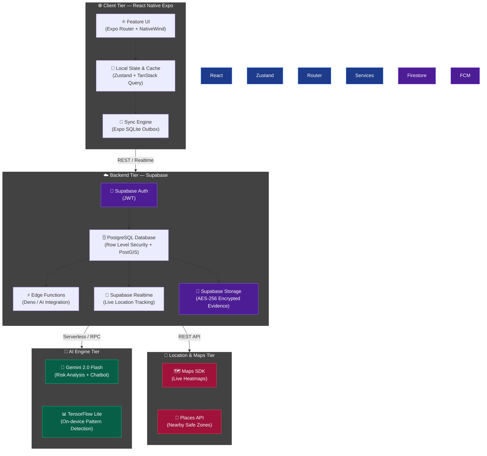
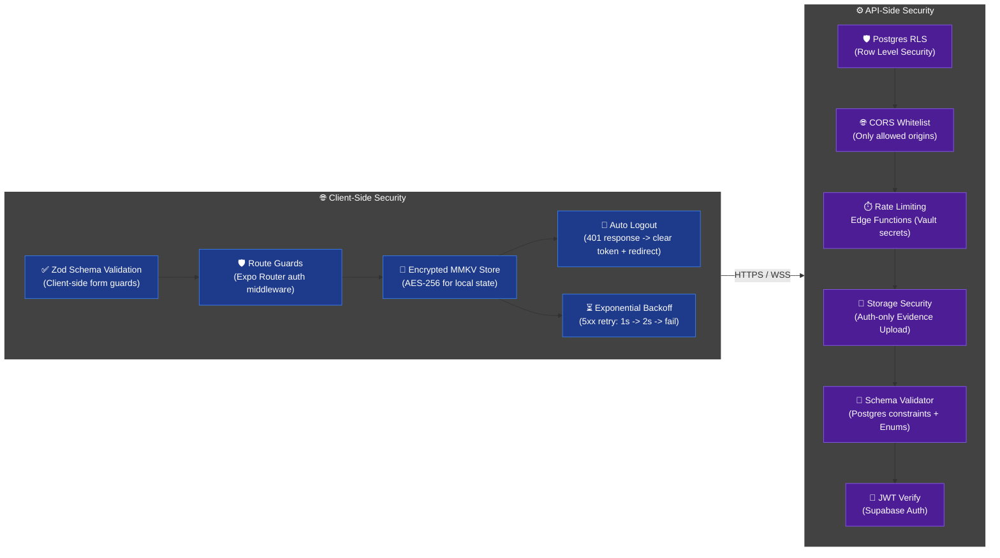
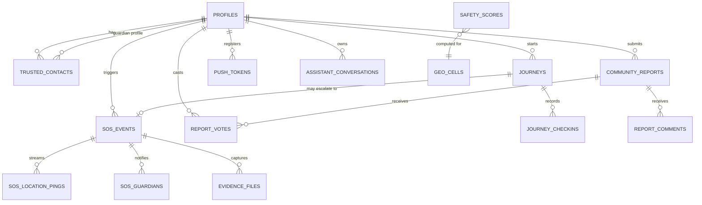

<p align="center">
  
</p>

<h1 align="center">SafeSphere AI</h1>
<h3 align="center"><code>Predict. Protect. Prevent.</code></h3>

<p align="center">
  <b>A Zero-Trust, Predictive Safety Ecosystem</b><br/>
  <sub>Next-generation intelligent safety platform leveraging Edge AI and zero-touch triggers.</sub>
</p>

<br/>

<p align="center">
  
  
  
  
</p>

---

## 🚨 The Reality of Women's Safety

In high-stress emergency situations, existing personal safety applications consistently fail at their core premise. They rely on a fundamentally **reactive model**: expecting a victim who is under physical threat, harassment, or extreme panic to possess the fine motor skills and time required to pull out a phone, unlock the screen, navigate to an app, and manually press an SOS button. 

When a real threat occurs, physical interaction with a device is often the first thing compromised. By the time a user manages to trigger an alarm, the critical window for prevention has already closed. Current apps act as passive digital pagers, failing victims exactly when they need an active shield the most.

---

## 🛡️ SafeSphere: A Predictive Approach

**SafeSphere AI** removes the burden of action from the victim. We are shifting personal safety from a model of *reactive panic* to **predictive intelligence and zero-touch intervention**.

We built a platform that acts as an autonomous digital bodyguard. By continuously analyzing environmental, spatial, and behavioral telemetry, SafeSphere detects risks before they escalate. If a threat materializes or the user is incapacitated, the system triggers invisible, hardware-level safeguards—broadcasting live location, recording encrypted evidence, and notifying guardians—all without requiring a single tap on the screen. SafeSphere knows when you are in danger and acts on your behalf.

---

## ✨ Core Capabilities

### 1. Predictive Risk Engine
Instead of waiting for an emergency, the system calculates a real-time **Safety Score (0-100)** using high-frequency telemetry data:
- **Spatial:** Live GPS against crowd-sourced crime heatmaps.
- **Environmental:** Ambient light sensor data and time-of-day.
- **Behavioral:** Accelerometer motion patterns and travel speed anomalies.

### 2. Multi-Modal Zero-Touch SOS
When physical interaction with a device is compromised, SafeSphere provides alternative, invisible triggers:
- **Voice Recognition:** Always-listening local ML model detecting distress keywords (`"Help"`, `"Stop"`).
- **Inertial Triggers:** High-G accelerometer shake detection.
- **Hardware Gestures:** Volume button sequence mapping.

### 3. Autonomous Legal Evidence Collection
Upon emergency activation, the system bypasses user interaction to secure verifiable, tamper-proof evidence:
- Simultaneous front/back camera photo capture.
- Continuous audio/video recording.
- **Instant Cloud Sync:** AES-256 encrypted payloads uploaded immediately to prevent data loss if the device is destroyed.

### 4. Guardian Telemetry Dashboard
Authorized contacts receive real-time access to a low-latency dashboard featuring:
- High-precision GPS tracking.
- Device health (Battery %, Network strength).
- Live Safety Score and activity status.

---

## 🏗️ System Architecture

The platform operates on a **Feature-First Clean Architecture** spanning the mobile client, Supabase backend, Edge Functions, and AI processing layer. Every component is purpose-built for high-throughput safety analytics at scale:



---

## 🔒 Security Architecture

The platform implements a **Zero-Trust, Defense-in-Depth** security model across both client and server tiers:



---

## 🗄️ Database Tier — PostgreSQL Schema



---

## 💻 Tech Stack Highlights

| Layer | Technology | Purpose |
|-------|------------|---------|
| **Core Framework** | React Native + Expo | Cross-platform mobile architecture |
| **State Management** | Zustand + React Query | Predictable local and server state sync |
| **Styling Engine** | NativeWind (Tailwind CSS) | Utility-first, performant glassmorphism |
| **Cloud Backend** | Supabase (Postgres/Auth/Edge/Realtime) | Robust RLS and scalable backend |
| **Offline Storage** | Expo SQLite (Drizzle ORM) | Durable SOS outbox and sync engine |
| **AI Processing** | Gemini 2.0 Flash + TF Lite | Millisecond-latency risk analysis |
| **Geolocation** | Google Maps Platform | Routing, Heatmaps, and Safe Zones |

---

## 🚀 Setup & Local Development

### Prerequisites
- Node.js `v18+`
- Expo CLI
- Docker (for local Supabase instance)
- Supabase CLI

### Installation

1. **Clone the repository:**
   ```bash
   git clone https://github.com/your-org/Infinity_Coders-v2v.git
   cd Infinity_Coders-v2v
   npm install
   ```

2. **Configure Environment:**
   ```bash
   cp .env.example .env
   # Add your API keys to .env
   ```

3. **Start Development Server:**
   ```bash
   npx expo start
   ```

   ```

---

## 📂 Project Structure & Feature Mapping

We follow a strict **Feature-First Clean Architecture**. Each domain is isolated to prevent tangled dependencies.

```text
Infinity_Coders-v2v/
├── src/
│   ├── features/               # Isolated feature modules
│   │   ├── auth/               # JWT, Phone verification, biometrics
│   │   ├── sos/                # Voice, shake triggers, emergency overlay
│   │   ├── journeys/           # Live tracking, route deviation
│   │   ├── trusted-contacts/   # Guardian management, permissions
│   │   ├── community-reports/  # Heatmaps, safe zones, reporting
│   │   ├── ai-assistant/       # Gemini chat, pattern prediction
│   │   └── evidence-vault/     # Hidden camera/audio, encrypted sync
│   │
│   ├── shared/                 # Core utilities shared across features
│   │   ├── ui/                 # Design system (Buttons, Cards, Modals)
│   │   ├── lib/                # Supabase client, SQLite sync engine
│   │   └── stores/             # Global Zustand state (UI theme, auth state)
│   │
│   ├── navigation/             # Expo Router layout & guards
│   └── i18n/                   # Multi-language translations
│
├── supabase/
│   ├── migrations/             # Postgres DDL & Row Level Security (RLS)
│   └── functions/              # Edge Functions (Deno) for AI & Notifications
│
└── assets/                     # Fonts, images, and brand assets
```

---

<p align="center">
  <sub>Designed and engineered for maximum reliability. Built by <b>Infinity Coders</b>.</sub>
</p>
